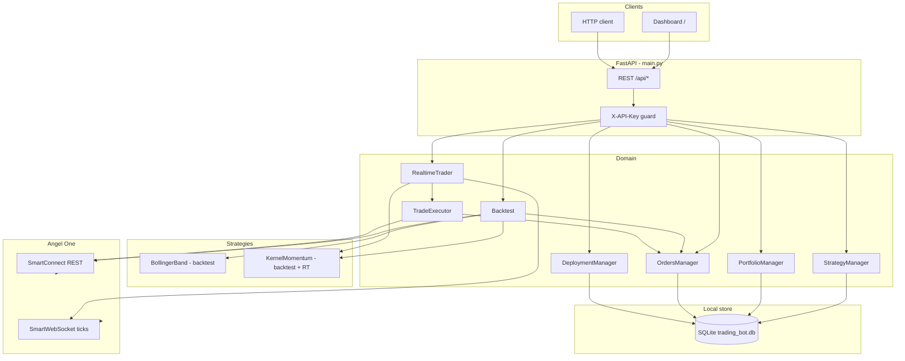
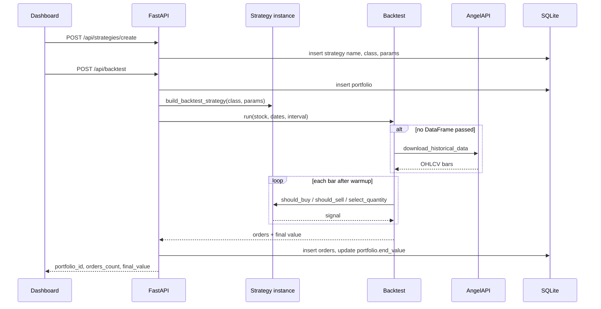
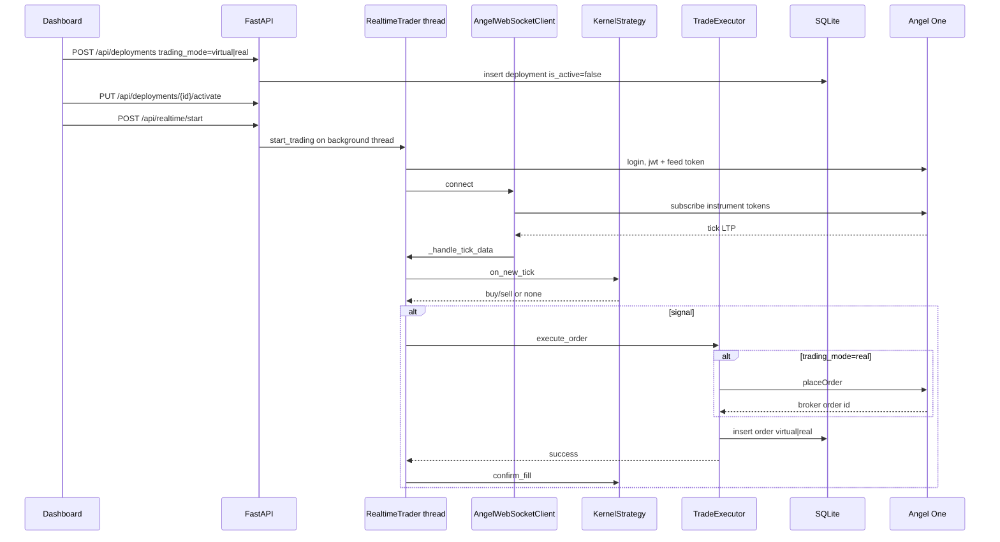
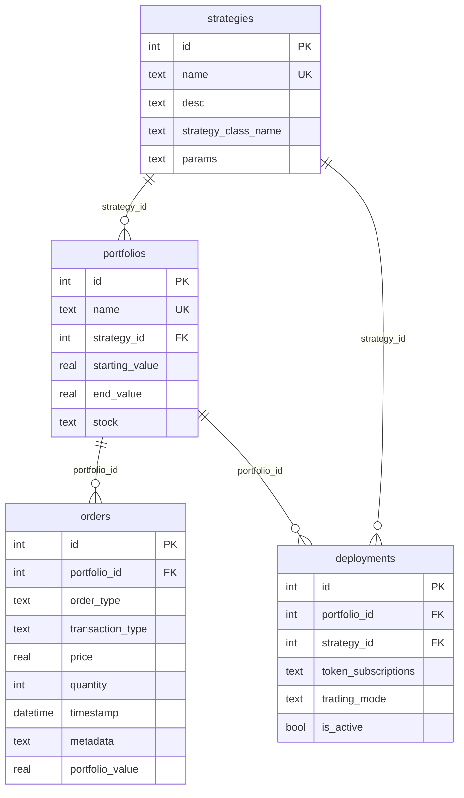

# TradingBot

Python trading platform for Indian equities through **Angel One SmartAPI**. You design a strategy, backtest it on historical candles, paper-trade the same logic on live ticks, then (optionally) send real orders.

The running product is a FastAPI server, a SQLite store, and a static dashboard. Broker login is optional at startup: the API comes up without credentials, but historical download, websocket ticks, and live orders need a valid Angel session.

## What is wired vs experimental

| Path | Role |
| --- | --- |
| `BollingerBand` | Registered for **backtest only** |
| `KernelMomentum` | Registered for **backtest and realtime** (virtual or real) |
| `strategies/low_risk_llm_equity/` | Standalone LLM backtest script (sandbox + news + kernel). Not exposed on the API |
| `dqn_trader`, `legacy_dqn_trader`, `RL_google_colab`, `RL_RNN_Intraday`, `LLM_Risk_Management`, `options_combinations`, `GPT_RL.py` | Research / notebook experiments. Not imported by `main.py` |

## Features

- Named strategy instances with JSON params stored in SQLite
- Historical backtest via Angel candle API; orders and `end_value` persisted on a portfolio
- Virtual (paper) and real deployments on websocket ticks
- Static dashboard at `/` to create strategies, run backtests, and inspect orders
- Optional `X-API-Key` on mutating routes; real trading requires that key plus an active Angel session

## System design

High-level components and how they talk to Angel One and SQLite:



### Backtest flow



### Realtime flow



### Data model



`order_type` is `backtest`, `virtual`, or `real`. `trading_mode` on a deployment is `virtual` or `real`.

## Repository layout

```
main.py                 FastAPI app, CORS, API key, uvicorn entrypoint
dashboard/index.html    Static UI served at GET /
db/                     SQLite schema + managers (foreign keys on)
base_models/            Strategy, Backtest, Order, AngelAPI, OHLC helpers
realtime/               RealtimeTrader, websocket client, TradeExecutor
strategies/             Strategy implementations (API + experiments)
utils/logger_setup.py   File + console logging helper
tests/                  DB, executor, sandbox, backtest tests
```

## Getting started

1. Clone the repo and create a virtualenv.
2. Install dependencies:

```sh
pip install -r requirements.txt
```

3. Copy `.env.example` to `.env` and fill in:

| Variable | Used for |
| --- | --- |
| `ANGEL_API_KEY` | SmartAPI key |
| `ANGEL_CLIENT_CODE` | Client code |
| `ANGEL_PASSWORD` | Login PIN/password |
| `ANGEL_TOTP` | TOTP secret |
| `OPENAI_API_KEY` | LLM equity script only |
| `TRADING_BOT_API_KEY` | Protects create / backtest / deploy / realtime routes |

Real trading is rejected if `TRADING_BOT_API_KEY` is unset or Angel is offline.

4. Tables are created on API startup. To create them alone:

```sh
python db/create_tables.py
```

5. Run the API:

```sh
python main.py
```

Server: `http://127.0.0.1:9000`. Open that URL for the dashboard. When `TRADING_BOT_API_KEY` is set, send it as `X-API-Key`.

6. Tests:

```sh
pytest
```

## API

| Method | Path | Auth | Notes |
| --- | --- | --- | --- |
| GET | `/` | no | Dashboard |
| GET | `/api/health` | no | Angel session + realtime running + whether API key is required |
| GET | `/api/strategies/objects` | no | `BollingerBand`, `KernelMomentum` |
| POST | `/api/strategies/create` | yes | `{name, strategy_class, params}` |
| GET | `/api/strategies/db` | no | Saved instances |
| GET | `/api/portfolios` | no | Optional `?strategy_id=` |
| GET | `/api/orders` | no | Optional `?portfolio_id=` |
| POST | `/api/backtest` | yes | Creates portfolio, runs backtest, stores orders and `end_value` |
| GET | `/api/deployments` | no | All deployments |
| GET | `/api/deployments/{id}` | no | One deployment |
| POST | `/api/deployments` | yes | `{portfolio_id, strategy_id, token_subscriptions, trading_mode}` |
| PUT | `/api/deployments/{id}/activate` | yes | Reloads subscriptions if the trader is running |
| PUT | `/api/deployments/{id}/deactivate` | yes | Same reload behavior |
| PUT | `/api/deployments/{id}/tokens` | yes | Replace websocket token list |
| POST | `/api/realtime/start` | yes | Websocket loop in a background thread |
| POST | `/api/realtime/stop` | yes | Disconnect and clear instances |

Auth = `X-API-Key` when `TRADING_BOT_API_KEY` is set. If that env var is empty, mutating routes stay open and a warning is logged.

## How a strategy plugs in

**Backtest** (`base_models/strategy.py`): implement `process_data`, `should_buy`, `should_sell`, `select_quantity`, then register the class in `BACKTEST_STRATEGY_CLASSES` in `main.py`.

**Realtime** (`strategies/base_strategy_rt.py`): implement `on_new_tick` (return a trade dict or `None`). Register in `STRATEGY_CLASS_MAP` in `realtime/realtime_trader.py`. Position size should change only in `confirm_fill` after `TradeExecutor` succeeds.

OHLC columns are normalized to `Open` / `High` / `Low` / `Close` / `Volume` before indicators run.

## LLM equity script

`strategies/low_risk_llm_equity/main.py` is a separate backtest: Angel candles → kernel signal → optional LLM-generated Python → news sentiment → orders CSV + HTML chart. Generated code is AST-checked and executed in a restricted sandbox (`os`, `eval`, and similar calls are rejected). It is not served by FastAPI.
